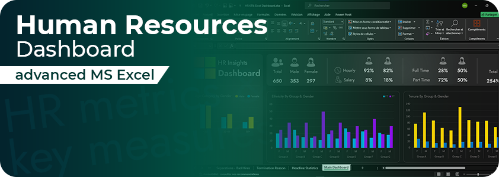
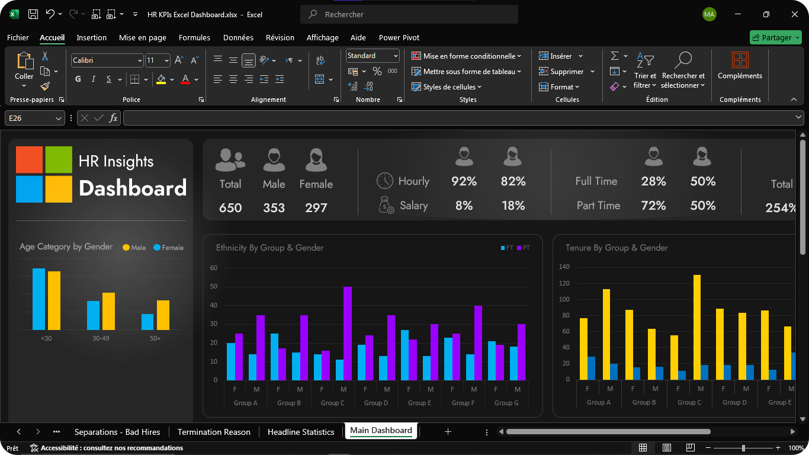
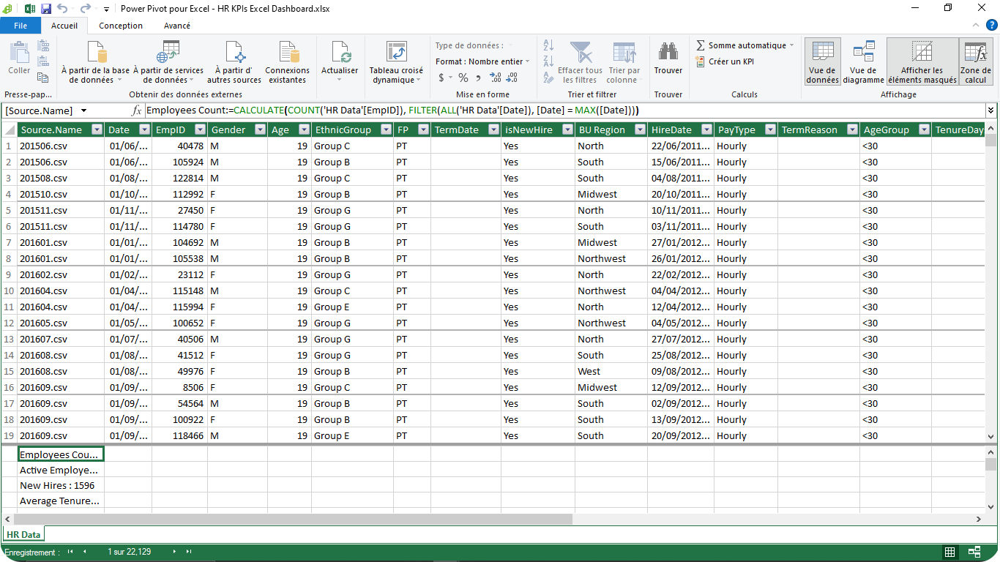
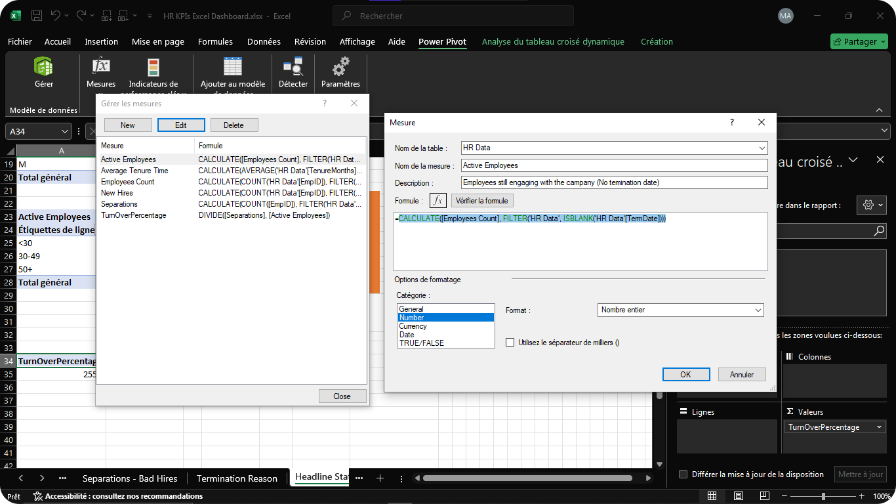
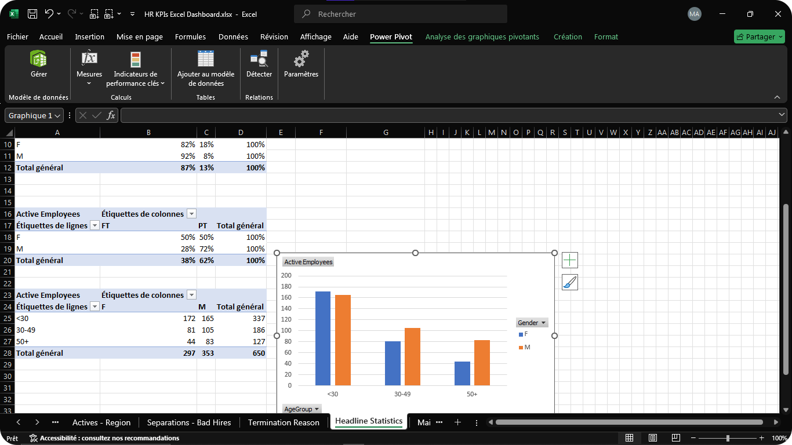

# Commercial Service KPIs Excel Dashboard

An Excel dashboard for X Company that monitors and analyzes HR data, offering insights into active employees, new hires, gender distribution, and more. It utilizes Power Pivot, pivot tables, advanced filters, and visualizations to provide comprehensive analytics.



## Usage

Use the [excel](https://www.microsoft.com/fr-fr/microsoft-365/excel) file to get the dashboard

```bash
Commercial HR KPIs Excel Dashboard.xlsx
```

## Details
The Excel file includes several key components:

- Raw Data: Contains the original HR data, including columns for employee details such as ID, name, department, hire date, gender, and status.
- Data Processing: Features cleaned and transformed data, with additional calculated metrics and summaries derived from the raw data.
- Pivot Tables: Various sheets dedicated to pivot tables analyzing different aspects of HR data, such as employee tenure, active employees, new hires, full-time vs. part-time status, and gender distribution.
- Dashboard: Consolidates visualizations and key metrics from the pivot tables into interactive charts and graphs, providing a comprehensive overview and insights into HR metrics.

## Demo

The Excel dashboard showcases a modern dark theme with a user-friendly interface for easier navigation.



Detailed view of textual and numeric data in Excel, providing a comprehensive look at the data set.



Power Pivot in action, utilizing DAX formulas to perform complex calculations and derive key measures.



Demonstration of Power Pivot's capabilities in extracting and presenting essential metrics and insights from the data.



## 🔗 Links

[](https://akhatarmourad.github.io/portfolio/)
[](https://www.linkedin.com/in/akhatarmourad/)